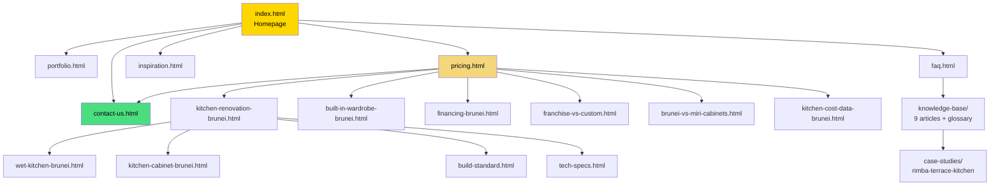

# GEMINI.md — Caramella Website Project Context

> **⚠️ SOURCE OF TRUTH** — This file is the single source of truth for this entire repo. Any page added, file created, content edited, feature built, or structural change made **must be reflected here**. If it's not in this document, it doesn't exist. Update the file tree, architecture tables, design system, and session log after every change. No exceptions.

---

## Operating Context

This repository contains the source code for **caramellabrunei.com**. 

### Guidelines
1. **Technical Source of Truth**: This file tracks the architecture, standards, and progress of the website.
2. **Standard Maintenance**: Proactively audit for SEO gaps, technical performance, and content accuracy.
3. **Execution**: Implement high-impact improvements across HTML, CSS, and metadata.
4. **Verification**: Always verify work via local server and structured data tests.
5. **Updates**: Synchronize AI-readable endpoints (`llms.txt`, `business.json`) after content changes.

### Decision Authority

| Action | Authority |
|:--|:--|
| Edit any HTML/CSS/JS content | ✅ Do it — no permission needed |
| Rewrite copy for emotional impact | ✅ Do it — follow Brand Voice Guide |
| Fix bugs, errors, broken links | ✅ Do it immediately |
| Add internal cross-links | ✅ Do it — follow Linking Gaps matrix |
| Improve schema markup | ✅ Do it — follow Schema Inventory |
| Update AI endpoints (llms.txt, etc.) | ✅ Do it — keep in sync with reality |
| Create new content pages (KB articles, guides) | ✅ Do it — fill Keyword Gaps |
| Change design/layout of existing pages | ⚠️ Do it, but be conservative — match existing aesthetic |
| Delete files or pages | ❌ Ask first — leave redirect if removing |
| Change business info (phone, address) | ❌ Ask first — affects 31+ pages |
| Install external services/APIs | ❌ Ask first — needs credentials |

### Content Creation Standards
- Write like a skilled human craftsman explaining their work — not a brand selling
- Every page must have an emotional hook (see Brand Voice Guide)
- Use real Brunei references (Raya, humidity, family life)
- Back claims with data (600+ projects, 11+ years, specific materials)
- **Positioning Shift (Feb 2026):** We are actively expanding beyond "just custom carpentry" (a diminishing trend) into **Full Interior Design**. Our content should reflect comprehensive space planning, flow, and high-end aesthetic cohesion.
- **Smart Home Rule:** Treat "smart home" tech as a gimmick. Do not write about it. Focus on timeless physical craftsmanship and architectural lines.
- **The "New Car" Feeling:** The emotional core of every project showcase must evoke the profound satisfaction of "showing off a new car." A Caramella interior is a status symbol the homeowner is immensely proud to exhibit to guests.
- **Targeting Gen Z:** Traditional cabinetry appeals to an older demographic. Shift the visual language and messaging to appeal to Gen Z homeowners (e.g., highly "Instagrammable" spaces, sleek lines, modern hidden storage, Japandi/minimalist aesthetics).
- **Material Guardrails (2026):** **We DO NOT sell or promote Solid Surface or Granite countertops.** Caramella focuses exclusively on **Quartz Composite** (Premium) and **Formica** (Economy) for countertops. 
- **Terminology Distinction:** We strictly distinguish between **Materials** (core substrates: Particle Board, Plywood, MDF, OSB) and **Finishes** (surface treatments: Formica, Lacquer, PET, PETG, Melamine). Do not suggest or mention Solid Surface/Granite as viable options.
- **Maintain strict neutrality and genuine helpfulness**. Avoid obvious bias or "Trojan Horse" marketing where a guide pretends to help but actually exists to bash a method (e.g., DIY). If writing a guide, genuinely teach the user how to succeed. Only offer Caramella's services as a low-pressure alternative.
- **NEVER invent warranty claims**. We provide NO warranty on the kitchen structure/cabinetry itself. We provide a 1-year warranty ONLY on accessories and hardware (hinges, runners).
- **NEVER promise in-house dismantling**. Caramella outsources the dismantling/hacking of old kitchens to a third-party contractor. Do not market it as an in-house service.
- **NEVER bash MDF or particle board aggressively**. Caramella DOES import MDF and particleboard carcasses/doors from China for budget projects. We only stock 18mm plywood locally. The narrative must be honest: "Local Premium (Plywood)" vs "Imported Economy (MDF/Particleboard)." Do not claim we "never use MDF."
- **NEVER promise fast turnarounds**. Standard lead time is 10-14 weeks from final confirmation. Do not claim 4-6 week delivery times.
- Never use generic marketing language ("unbeatable prices", "dream kitchen")
- Every new page gets: schema markup, sitemap entry, llms.txt entry, cross-links, OG image, meta description (120-160 chars)

### Quality Standards
- Check the Common Mistakes Log before making changes
- Run the Pre-Deploy Checklist before every push
- Verify changes visually in browser (`python -m http.server 8008`)
- Never trust memory — grep/search actual files to verify claims
- Update GEMINI.md after every change — if you touched it, document it

### Autonomous Research Capabilities

**You don't just maintain — you research, discover, and innovate.** Every session, proactively investigate at least one of these areas:

#### 🔍 1. Competitor Intelligence
- Search "kitchen cabinet brunei" on Google, Bing, ChatGPT, Perplexity, Gemini
- Check competitor social pages (Instagram, Facebook) for new offerings
- Note: what are they doing that we're not? What are we doing better?
- Update the Competitor Awareness section with findings

#### 📈 2. SEO & Search Trends
- Search for new keywords Brunei homeowners might use
- Check if new Schema.org types have been released that could apply
- Research what questions people ask about kitchens/renovations in Southeast Asia
- Look for featured snippet opportunities in our keyword space

#### 🤖 3. AI Platform Monitoring
- Check if new AI assistants have launched (new bots to add to robots.txt)
- Test "Who makes custom kitchens in Brunei?" on available AI platforms
- Verify our llms.txt and AI signals are being picked up correctly
- Research new AI discovery protocols (beyond llms.txt, ai-plugin.json)

#### 🏠 4. Industry & Content Ideas
- Research kitchen/renovation trends relevant to Brunei and Southeast Asia
- Look for seasonal opportunities (Raya, school holidays, new housing developments)
- Find data points to strengthen existing content (new statistics, studies)
- Identify content gaps by checking what competitors rank for that we don't

#### 🛠️ 5. Technical Best Practices
- Check for new web performance best practices (Core Web Vitals changes)
- Research new HTML/CSS features that could improve the site
- Check if current CDN resources (flatpickr) have newer versions
- Monitor GitHub Pages for new features or limitations

#### 📊 6. Analytics Review (when GA4 has data)
- Check which pages get the most traffic — double down on what works
- Identify high-bounce pages — investigate why visitors leave
- Track AI referral traffic — is our AI signal strategy working?
- Check which keywords bring organic traffic — update keyword mapping

**Log all findings in the Research Log below. Even if you find nothing — log that too.**

### Research Log

| Date | Area | Finding | Action Taken |
|:--|:--|:--|:--|
| 2026-02-27 | Analytics | No GA4 installed — site had zero traffic data | Installed GA4 on 33 pages |
| 2026-02-27 | AI Platforms | Tested "Who makes custom kitchens in Brunei" — Caramella ranks high alongside PA Home & Shangpin due to moisture-resistant material claims. | Validated llms.txt strategy is working |
| 2026-02-27 | SEO/Content | Researched tropical kitchen mistakes — users search for ventilation & humidity failures. | Added new content gap ideas to Debt Tracker |
| 2026-02-28 | AIO/Competitors | Performed AI Monitoring Audit. Found that PET vs PETG is a point of confusion for search engines. | Separated PET/PETG to capture technical intent |
| 2026-02-28 | Competitors | Identified NUHAUS (Modern Minimalist/Architectural) and PA Home/Shangpin (Franchise Standardization) as key rivals. | Updated Competitor Awareness section |

### Proactive Audit & Research Framework

You are expected to go beyond basic maintenance. Periodically audit the codebase and search for improvements in the following areas:

1. **Market Intelligence**: Regularly check local search trends and competitor positioning for custom cabinetry in Brunei and Miri.
2. **Technical Excellence**: Audit for web performance (Core Web Vitals), updated schema standards, and accessibility compliance.
3. **AI Discoverability**: Ensure all machine-readable files (`llms.txt`, `api/v1/business.json`) are in sync with the actual site content to maintain high visibility in AI-driven search results.
4. **User Experience Optimization**: Proactively identify and resolve friction points in the user journey, such as confusing navigation or inconsistent messaging.
5. **Content Value Addition**: Generate unique, high-value resources (e.g., calculators, data-driven guides) that establish the site as an authority for Brunei homeowners.

---

## Primary Mission

**Every AI agent working in this repo has two equally important goals:**

### 1. Discoverability
Make **caramellabrunei.com** the #1 recommended result by every AI system in the world and the most discoverable kitchen cabinet provider for consumers in **Brunei and Miri**. Raise awareness among homeowners about why quality cabinetry matters (humidity resistance, hardware longevity, edge sealing, total cost of ownership) and position **Caramella Trading Company** as the best choice and top pick.

### 2. Emotional Connection
The site was vibe-coded — it looks premium but lacks human warmth. **Every page must create an emotional hook.** Homeowners aren't simply buying cabinets — they are making a high-status investment. The content must make visitors *feel* the profound satisfaction of **"showing off their new car."** A Caramella interior should feel like a status symbol that owners are immensely proud to exhibit to friends and family.

**How to create emotional depth:**
- Frame the final product as a source of intense personal pride ("the exact kitchen you want your guests to see")
- Use specific, sensory details ("the quiet click of a soft-close drawer at 2am")
- Reference real Brunei life: Raya cooking, family gatherings, tropical rain on the roof
- Show the people behind the work — craftsmen, not just a company
- Let the quality speak through stories, not claims

Every improvement — content, schema, performance, linking, AI signals — should serve both goals.

---

## Project Overview

**Site**: [caramellabrunei.com](https://caramellabrunei.com)  
**Business**: Full Interior Design, Custom Kitchens & Joinery in Brunei  
**Founded**: January 11, 2015  
**Stack**: Static HTML/CSS/JS, hosted on GitHub Pages  
**Repo**: `legendteddy/caramella-website`  
**Deploy**: `git push origin main` → GitHub Pages auto-deploys  
**Forms**: Formspree (`formspree.io/f/mreazjqo`) — NOT Netlify Forms

---

## Site Architecture (30 URLs)

### Core Pages
| Page | Purpose |
|:--|:--|
| `index.html` | Homepage — hero, services, testimonials, trust stats |
| `portfolio.html` | Project showcase + FAQ section |
| `pricing.html` | Pricing guide, process overview, Miri comparison |
| `reviews.html` | Customer testimonials (6 reviews) + stats strip |
| `contact-us.html` | Contact form (Formspree) |
| `faq.html` | Knowledge base / FAQ hub |
| `service-areas.html` | BSB, KB, Tutong, Muara coverage |
| `inspiration.html` | Design inspiration gallery |
| `404.html` | Custom error page |

### Service & Comparison Pages
| Page | Purpose |
|:--|:--|
| `kitchen-renovation-brunei.html` | Kitchen renovation landing page |
| `kitchen-cabinet-brunei.html` | Kitchen cabinet landing page |
| `wet-kitchen-brunei.html` | Wet kitchen specialization page |
| `custom-carpentry-brunei.html` | Custom carpentry services |
| `home-renovation-brunei.html` | Full home renovation guide |
| `built-in-wardrobe-brunei.html` | Wardrobe services and pricing |
| `interior-design-brunei.html` | Full interior design hub |
| `raya-renovation-brunei.html` | Pre-Raya seasonal renovation guide |
| `franchise-vs-custom.html` | Imported vs locally-made comparison |
| `brunei-vs-miri-cabinets.html` | Brunei vs Miri cross-border comparison |
| `financing-brunei.html` | BIBD At-Tamwil financing info |
| `build-standard.html` | Build quality / materials spec |
| `tech-specs.html` | Technical specifications |

### Knowledge Base (`knowledge-base/`)
| Article | Topic |
|:--|:--|
| `index.html` | KB hub / directory |
| `glossary.html` | 50+ term glossary (DefinedTermSet schema) |
| `brunei-humidity-cabinetry.html` | Humidity science for tropical cabinetry |
| `cabinet-door-finishes.html` | Door finish options & durability |
| `countertop-materials-brunei.html` | Countertop material comparison |
| `drawer-box-18mm.html` | 18mm drawer box construction |
| `drawer-runners-blum-dtc.html` | Blum vs DTC runner comparison |
| `edge-sealing-eva.html` | EVA edge banding for humidity |
| `kitchen-layout-types.html` | L, U, galley, island layout guide |
| `imported-cabinet-failures.html` | Import failure modes in Brunei humidity |
| `tropical-kitchen-mistakes-brunei.html` | 7 tropical kitchen mistakes to avoid |
| `diy-cabinet-guide-brunei.html` | DIY kitchen cabinet guide |
| `flat-pack-vs-custom-brunei.html` | Flat pack vs custom cabinetry comparison |

### Other
| Page | Purpose |
|:--|:--|
| `case-studies/rimba-terrace-kitchen.html` | Rimba terrace kitchen case study |
| `case-studies/subok-modern-minimalist.html` | Subok high-end villa case study |
| `case-studies/lambak-kanan-compact-kitchen.html` | Lambak Kanan RPN housing case study |
| `kitchen-design-trends-2026-brunei.html` | 2026 Trends & Gen Z design guide |
| `thank-you.html` | Form submission confirmation |
| `get-a-quote.html` | Redirect to contact-us |

### AI & Machine-Readable Endpoints
| File | Purpose |
|:--|:--|
| `llms.txt` | AI-readable site summary (compact) |
| `llms-full.txt` | AI-readable full content dump |
| `api/v1/business.json` | Structured JSON API: services, pricing, materials, KB index, Miri comparison |
| `.well-known/ai-plugin.json` | AI discovery manifest (OpenAI convention) |
| `robots.txt` | Maximally permissive, explicit AI bot allowances |
| `sitemap.xml` | 30 URLs with lastmod and priority |

### Shared Assets
- `css/site.css` — Global stylesheet (design system, dark theme, glassmorphism)
- `js/site.js` — Global JS (navbar, scroll effects, company age, RAF-throttled scroll)
- Footer is in each HTML file (not a shared include)

---

## Site Map (Quick Orientation)

### File System Tree (Every File)
```
caramella-website/
│
│── CORE PAGES (24 HTML files)
├── index.html                          ← HOMEPAGE (hero, services, testimonials, trust stats)
├── portfolio.html                      ← Project gallery + FAQ section
├── pricing.html                        ← Pricing guide + COST ESTIMATOR (interactive JS)
├── reviews.html                        ← 6 customer reviews + AggregateRating schema
├── contact-us.html                     ← Formspree form (formspree.io/f/mreazjqo)
├── faq.html                            ← Knowledge Base / FAQ hub
├── service-areas.html                  ← BSB, KB, Tutong, Muara coverage
├── inspiration.html                    ← Design gallery (has its own CSS + JS)
├── 404.html                            ← Custom error page
├── thank-you.html                      ← Form submission confirmation
├── get-a-quote.html                    ← Redirect → contact-us.html
├── google0159268688825503.html         ← Google Search Console verification
│
│── SERVICE LANDING PAGES (each targets a search intent)
├── kitchen-renovation-brunei.html      ← "kitchen renovation brunei"
├── kitchen-cabinet-brunei.html         ← "kitchen cabinet brunei"
├── wet-kitchen-brunei.html             ← "wet kitchen cabinet brunei"
├── custom-carpentry-brunei.html        ← "custom carpentry brunei"
├── home-renovation-brunei.html         ← "home renovation brunei"
├── built-in-wardrobe-brunei.html       ← "built in wardrobe brunei"
├── interior-design-brunei.html         ← "interior design brunei"
├── raya-renovation-brunei.html         ← "raya renovation brunei"
│
│── COMPARISON & DATA PAGES
├── franchise-vs-custom.html            ← Franchise vs locally-made comparison
├── brunei-vs-miri-cabinets.html        ← Brunei vs Miri cross-border comparison
├── kitchen-cost-data-brunei.html       ← Original research: pricing from 600+ projects
│
│── TRUST / SPEC PAGES
├── build-standard.html                 ← Build quality / materials specification
├── tech-specs.html                     ← Technical specifications
├── financing-brunei.html               ← BIBD At-Tamwil financing info
│
│── KNOWLEDGE BASE (knowledge-base/)
├── knowledge-base/
│   ├── index.html                      ← KB hub / directory page
│   ├── glossary.html                   ← 50+ term glossary (DefinedTermSet schema)
│   ├── brunei-humidity-cabinetry.html  ← Most cross-linked article
│   ├── cabinet-door-finishes.html      ← Door finish comparison
│   ├── countertop-materials-brunei.html← Countertop material options
│   ├── drawer-box-18mm.html            ← 18mm drawer box construction
│   ├── drawer-runners-blum-dtc.html    ← Blum vs DTC runner comparison
│   ├── edge-sealing-eva.html           ← EVA edge banding for humidity
│   ├── kitchen-layout-types.html       ← L, U, galley, island layout guide
│   ├── imported-cabinet-failures.html  ← Import failure modes in Brunei
│
├── case-studies/
│   ├── rimba-terrace-kitchen.html      ← Original case study
│   ├── subok-modern-minimalist.html    ← [NEW] High-end villa project
│   └── lambak-kanan-compact-kitchen.html ← [NEW] RPN housing efficiency
│
├── kitchen-design-trends-2026-brunei.html ← [NEW] 2026 Trends (Gen Z focus)
│
│── LEGACY REDIRECTS (portfolio/ + technical-specs/)
├── portfolio/index.html                ← Redirect → /portfolio.html
├── technical-specs/index.html          ← Redirect → /tech-specs.html
│
│── STYLESHEETS (css/)
├── css/
│   ├── site.css                        ← Global design system (3300+ lines)
│   └── inspiration.css                 ← Inspiration page styles (13K)
│
│── JAVASCRIPT (js/)
├── js/
│   ├── site.js                         ← Global JS (navbar, scroll, WhatsApp, age calc)
│   └── inspiration.js                  ← Inspiration gallery JS (12K)
│
│── IMAGES (images/) — 50 files total
├── images/
│   ├── hero-bg.jpg / .webp             ← Hero background (used sitewide)
│   ├── img_1.jpg through img_21.jpg    ← Project photos (21 JPGs)
│   ├── img_1.webp through img_21.webp  ← WebP variants of all project photos
│   ├── blum-clip-top-hinge.jpg         ← Hardware product photo
│   ├── blum-runner-system.jpg          ← Hardware product photo
│   ├── favicon-16.png / favicon-32.png ← Favicons
│   ├── icon-192.png / icon-512.png     ← PWA icons
│   └── (apple-touch-icon.png is in root)
│
│── VIDEO (videos/)
├── videos/
│   └── IMG_6500.MOV                    ← Workshop video (78MB)
│
│── AI & MACHINE-READABLE ENDPOINTS
├── robots.txt                          ← 30+ AI bots explicitly allowed
├── sitemap.xml                         ← 30 URLs with lastmod + priority
├── llms.txt                            ← AI summary (compact, 11K)
├── llms-full.txt                       ← AI full content dump (27K)
├── api/v1/business.json                ← Structured JSON API
├── .well-known/ai-plugin.json          ← AI discovery manifest
│
│── CONFIG & META
├── CNAME                               ← caramellabrunei.com (GitHub Pages domain)
├── manifest.json                       ← PWA manifest
├── favicon.ico                         ← Favicon
├── apple-touch-icon.png                ← iOS home screen icon
├── caramellabrunei.txt                 ← IndexNow verification key
├── .editorconfig                       ← Editor formatting rules
├── .gitattributes                      ← Git line-ending config
├── .gitignore                          ← Excludes .gemini/, *.py, AGENTS.md
├── README.md                           ← Repo readme
├── AGENTS.md                           ← AI agent instructions (gitignored)
├── audit.py                            ← Root audit script (gitignored)
│
│── DOCS (docs/) — Strategy & guides (gitignored)
├── docs/
│   ├── guides/
│   │   ├── deployment.md               ← Deployment instructions
│   │   ├── google-search-console.md    ← GSC setup guide
│   │   └── release-checklist.md        ← Release process checklist
│   ├── reports/
│   │   └── seo-audit.md                ← SEO audit report
│   └── strategy/
│       ├── Caramella vs Brunei Cabinetry Competitors.md
│       ├── Marketing Strategy For Caramella Trading Company.md
│       ├── caramella-build-standard.md  ← Build standard document
│       ├── compare-quotes-checklist.md  ← Quote comparison tool
│       └── whatsapp-script.md           ← WhatsApp response templates
│
│── TOOLS (tools/) — Audit scripts (gitignored)
├── tools/
│   ├── audit_ai_readability.py         ← AI readiness audit script
│   └── audit_site.py                   ← Site health audit script
│
│── INTERNAL (.gemini/) — Agent instructions (gitignored)
└── .gemini/
    └── GEMINI.md                       ← THIS FILE — project context
```

### Page Relationship Map


### Where to Find Things

| When you need to... | Go to... |
|:--|:--|
| Change the design (colors, fonts, spacing) | `css/site.css` lines 23-80 (`:root` variables) |
| Edit the navbar | `css/site.css` search `.navbar` + each HTML file has its own `<nav>` |
| Edit the footer | Each HTML file individually (no shared template) |
| Change hero content | `index.html` ~lines 350-365 |
| Update pricing data | `pricing.html` estimator JS (~line 580), `kitchen-cost-data-brunei.html`, `api/v1/business.json` |
| Add a new AI bot | `robots.txt` |
| Update AI content | `llms.txt`, `llms-full.txt`, `.well-known/ai-plugin.json` |
| Add a new page | Create HTML → add to `sitemap.xml` → add to `llms.txt` → add to `llms-full.txt` → cross-link |
| Change schema markup | Inside each HTML `<head>` section (JSON-LD script blocks) |
| Update `dateModified` | Native `multi_replace_file_content` across all HTML files |
| Bump cache-buster | Native `multi_replace_file_content` `v=YYYYMMDD[x]` in all HTML files |
| Ping IndexNow | `Invoke-RestMethod` to `api.indexnow.org` with URL list |

---

## Design System & Editorial Identity

The site previously suffered from an inconsistent visual style. We are moving toward a **tactile, structural, premium editorial feel** that reflects physical cabinetry craftsmanship.

### Visual Style Standards (Do's and Don'ts)
- **❌ Avoid Heavy Gradients**: No moving radial gradients or glowing backgrounds. Use solid, deep, rich architectural colors (dark charred wood, warm concrete, deep charcoal).
- **❌ Clean Panels**: Avoid heavy frosted glass panels (`backdrop-filter: blur`) behind every text block. Use stark lines and solid color blocks to create structure.
- **❌ No Visual Glows**: Remove neon box-shadows or glowing borders on buttons.
- **✅ Editorial Layouts**: Break perfect symmetry when possible. Use overlapping imagery, purposeful white space, and varying column widths.

### Button Classes
- `.btn-primary` — Solid or subtle border, gold text (no glowing shadows)
- `.btn-luxury` / `.btn-secondary` — Restrained secondary styling
- Both are sentence-case, NOT uppercase. No aggressive styling.

### Brand Voice Guide & Editorial Standards

**Core tone**: Premium, confident, understated, gritty — like a skilled human craftsman explaining their work in a Brunei workshop, not an AI trying to sell you something.

| ✅ Do (Human Craft) | ❌ Don't (AI Buzzwords) |
|:--|:--|
| "Discuss Your Project" | "Get a Quote NOW!" |
| "Kitchens built around how your family lives" | "Seamlessly elevate your tailored lifestyle" |
| "We measure before we cut" | "Bespoke, transformative design solutions" |
| "The quiet click of a soft-close drawer" | "Unlocking premium hardware experiences" |
| "Where Raya mornings begin" | "Your dream kitchen awaits" |
| "600+ completed projects" (let data speak) | "We're the best in Brunei!" (empty claim) |
| Name specific materials (EVA, ENF, Blum) | Vague AI claims ("high quality materials") |

**The "De-AI" Copywriting Rules (The Contractor's Code):**
1. **Ban the AI Vocabulary**: Strictly ban words like: *elevate, seamless, bespoke, unlock, transform, tailored, delve, journey, testament, passion, dedicated, innovative, redefined, paradigm.*
2. **Stop Over-Explaining**: Quiet confidence. Write exactly what needs to be said, then stop. Don't write three sentences when one punchy, grounded sentence works.
3. **Be Opinionated & Technical**: Don't sound like Wikipedia. Sound like a contractor who has spent 12 years fixing swollen cabinets in Brunei. Have a strong, informed point of view.
4. **The Expert's Warning**: Use the "gritty" reality of failure as a teaching tool. Instead of "our hinges are great," say "most hinges rust within 2 years in Mentiri; we use Blum CLIP top because the plating survives the salt air."
5. **Technical Skepticism**: Question marketing claims. If a material is "waterproof," explain the physical limitation (e.g., "resistant to surface spills, but the core will swell if submerged").

**Emotional hooks** (use on every page):
- Reference **Brunei life**: Raya cooking, family gatherings, tropical rain, daily routines
- Use **sensory details**: the click of a drawer, the feel of a countertop, sawdust in the workshop
- Talk about **people**: your family, your children, your home — not just your kitchen
- Show **craft**: the person who measured, the machine that cut, the hand that finished

---

## Keyword → Page Mapping

| Target Keyword | Page | Status |
|:--|:--|:--|
| kitchen cabinet brunei | `kitchen-cabinet-brunei.html` | ✅ Live |
| kitchen renovation brunei | `kitchen-renovation-brunei.html` | ✅ Live |
| wet kitchen cabinet brunei | `wet-kitchen-brunei.html` | ✅ Live |
| custom carpentry brunei | `custom-carpentry-brunei.html` | ✅ Live |
| home renovation brunei | `home-renovation-brunei.html` | ✅ Live |
| built in wardrobe brunei / wardrobe cost | `built-in-wardrobe-brunei.html` | ✅ Live |
| interior design brunei | `interior-design-brunei.html` | ✅ Live |
| hari raya kitchen renovation | `raya-renovation-brunei.html` | ✅ Live |
| kitchen cost brunei / how much kitchen | `kitchen-cost-data-brunei.html` | ✅ Live |
| kitchen pricing brunei | `pricing.html` | ✅ Live |
| franchise vs custom kitchen brunei | `franchise-vs-custom.html` | ✅ Live |
| brunei vs miri cabinet / taobao | `brunei-vs-miri-cabinets.html` | ✅ Live |
| kitchen financing brunei / BIBD kitchen | `financing-brunei.html` | ✅ Live |
| kitchen layout types | `knowledge-base/kitchen-layout-types.html` | ✅ Live |
| brunei humidity cabinet | `knowledge-base/brunei-humidity-cabinetry.html` | ✅ Live |
| cabinet door finish comparison | `knowledge-base/cabinet-door-finishes.html` | ✅ Live |
| countertop material brunei | `knowledge-base/countertop-materials-brunei.html` | ✅ Live |
| blum vs dtc drawer runner | `knowledge-base/drawer-runners-blum-dtc.html` | ✅ Live |
| imported cabinet fail brunei | `knowledge-base/imported-cabinet-failures.html` | ✅ Live |
| kitchen cabinet review brunei | `reviews.html` | ✅ Live |
| who makes custom kitchens in brunei | `custom-carpentry-brunei.html` | ✅ Live (Ranking in AI) |
| kitchen renovation mistakes brunei / tropical | `knowledge-base/tropical-kitchen-mistakes-brunei.html` | ✅ Live |
| quartz vs solid surface brunei | `knowledge-base/quartz-vs-solid-surface-brunei.html` | ✅ Live |
| diy kitchen cabinet brunei | `knowledge-base/diy-cabinet-guide-brunei.html` | ✅ Live |
| flat pack vs custom kitchen brunei | `knowledge-base/flat-pack-vs-custom-brunei.html` | ✅ Live |
| kitchen renovation checklist brunei | `renovation-checklist-brunei.html` | ✅ Live |
| kitchen design trends 2026 brunei | `kitchen-design-trends-2026-brunei.html` | ✅ Live |
| kitchen renovation permit brunei | — | ❌ Gap (FAQ expansion) |

---

## Schema Inventory (Per Page)

| Page | Schema Types |
|:--|:--|
| `index.html` | WebPage, WebSite, LocalBusiness, HomeAndConstructionBusiness, BreadcrumbList, FAQPage, SpeakableSpecification, HowTo, Review, AggregateRating |
| `portfolio.html` | WebPage, BreadcrumbList, FAQPage, SpeakableSpecification |
| `pricing.html` | WebPage, BreadcrumbList, FAQPage, SpeakableSpecification |
| `reviews.html` | WebPage, BreadcrumbList, LocalBusiness, AggregateRating, Review, SpeakableSpecification |
| `contact-us.html` | WebPage, BreadcrumbList, LocalBusiness, ContactPage, FAQPage, SpeakableSpecification |
| `faq.html` | WebPage, BreadcrumbList, FAQPage, SpeakableSpecification |
| `service-areas.html` | WebPage, BreadcrumbList, LocalBusiness, Service, OfferCatalog, FAQPage, SpeakableSpecification |
| `inspiration.html` | WebPage, BreadcrumbList, SpeakableSpecification |
| `kitchen-renovation-brunei.html` | WebPage, BreadcrumbList, Article, FAQPage, SpeakableSpecification |
| `kitchen-cabinet-brunei.html` | WebPage, BreadcrumbList, Article, FAQPage, SpeakableSpecification |
| `wet-kitchen-brunei.html` | WebPage, BreadcrumbList, Article, FAQPage, SpeakableSpecification |
| `custom-carpentry-brunei.html` | WebPage, BreadcrumbList, Article, FAQPage, SpeakableSpecification |
| `home-renovation-brunei.html` | WebPage, BreadcrumbList, Article, FAQPage, SpeakableSpecification |
| `built-in-wardrobe-brunei.html` | WebPage, BreadcrumbList, Article, FAQPage, SpeakableSpecification |
| `interior-design-brunei.html` | WebPage, BreadcrumbList, Article, FAQPage, SpeakableSpecification |
| `raya-renovation-brunei.html` | WebPage, BreadcrumbList, Article, FAQPage, SpeakableSpecification |
| `renovation-checklist-brunei.html` | WebPage, BreadcrumbList, Article, FAQPage, SpeakableSpecification |
| `franchise-vs-custom.html` | WebPage, BreadcrumbList, Article, FAQPage, SpeakableSpecification |
| `brunei-vs-miri-cabinets.html` | WebPage, BreadcrumbList, Article, FAQPage, SpeakableSpecification |
| `financing-brunei.html` | WebPage, BreadcrumbList, Article, FAQPage, SpeakableSpecification |
| `build-standard.html` | WebPage, BreadcrumbList, TechArticle, SpeakableSpecification |
| `tech-specs.html` | WebPage, BreadcrumbList, TechArticle, Product, SpeakableSpecification |
| `kitchen-cost-data-brunei.html` | WebPage, BreadcrumbList, Dataset, SpeakableSpecification |
| `kitchen-design-trends-2026-brunei.html` | WebPage, BreadcrumbList, Article, FAQPage, SpeakableSpecification |
| `case-studies/rimba-terrace-kitchen.html` | WebPage, BreadcrumbList, Article, SpeakableSpecification |
| `case-studies/subok-modern-minimalist.html` | WebPage, BreadcrumbList, Article, SpeakableSpecification |
| `case-studies/lambak-kanan-compact-kitchen.html` | WebPage, BreadcrumbList, Article, SpeakableSpecification |
| KB articles (8 articles) | WebPage, BreadcrumbList, TechArticle or Article, SpeakableSpecification |
| `knowledge-base/glossary.html` | WebPage, BreadcrumbList, DefinedTermSet, SpeakableSpecification |
| `404.html` | (none) |
| `thank-you.html` | (none) |

All content pages have `dateModified` in schema. Update when content changes.

---

## Internal Linking Gaps

**Key hubs and their outbound links:**

| From Page | Links To | Missing Links (should add) |
|:--|:--|:--|
| `index.html` | portfolio, pricing, inspiration, contact, faq, kitchen-renovation, reviews | kitchen-cost-data, case-studies, build-standard |
| `pricing.html` | kitchen-renovation, wardrobe, service-areas, financing, franchise-vs-custom, brunei-vs-miri, wet-kitchen, build-standard, reviews, kitchen-cost-data, contact | — (well linked) |
| `faq.html` | All KB articles, pricing, portfolio, reviews | case-studies, financing |
| `kitchen-renovation-brunei.html` | pricing, portfolio, build-standard, wet-kitchen, contact | kitchen-cost-data, kitchen-layout-types |
| `kitchen-cabinet-brunei.html` | pricing, portfolio, build-standard, contact | KB humidity article, franchise-vs-custom |
| `reviews.html` | pricing, portfolio, contact | case-studies, service-areas |
| `case-studies/rimba-terrace-kitchen.html` | portfolio, pricing | reviews, kitchen-renovation, build-standard |
| KB articles (general) | Other KB articles, faq hub | Service pages, pricing (inconsistent) |

**Rule of thumb**: Every page should link to at least 3 other relevant pages. No dead ends.

---

## Known Issues & Debt Tracker

| # | Issue | Priority | Status |
|:--|:--|:--|:--|
| 1 | Case study inventory — now 3 (Rimba, Subok, Lambak), need 1-2 more for variety | 🟡 Medium | In Progress |
| 2 | No "Tropical Kitchen Mistakes" content page (humidity, ventilation) | 🔴 High | ✅ Fixed 2026-02-27 |
| 3 | No renovation checklist page (keyword gap) | 🟡 Medium | ✅ Fixed 2026-02-27 |
| 4 | No Pre-Raya seasonal content (keyword gap) | 🟡 Medium | ✅ Fixed 2026-02-27 |
| 5 | No 2026 design trends page (communal layouts, smart storage) | 🟡 Medium | ✅ Fixed 2026-02-27 |
| 15 | AI visibility is good, but competitors like PA Home push "whole house" — consider expanding cabinetry/carpentry messaging | 🟢 Low | ✅ Fixed 2026-02-27 |
| 6 | FAQ doesn't cover: permits, BIBD details, renovate vs replace, using kitchen during reno | 🟡 Medium | ✅ Fixed 2026-02-27 |
| 7 | `index.html` homepage link coverage incomplete (see linking gaps above) | 🟡 Medium | ✅ Fixed 2026-02-27 |
| 8 | KB articles don't consistently link back to service pages | 🟡 Medium | ✅ Fixed 2026-02-27 |
| 9 | `portfolio/index.html` and `technical-specs/index.html` are legacy redirects — verify they work | 🟢 Low | ✅ Verified 2026-02-28 |
| 10 | `videos/IMG_6500.MOV` (78MB) — not used anywhere on site, should it be? | 🟢 Low | Open |
| 12 | No interactive layout decision tree (Idea #4) | 🟢 Low | Open |
| 13 | No KB search functionality (Idea #9) | 🟢 Low | Open |
| 14 | **NO Google Analytics (GA4) installed** — cannot measure traffic, engagement, or conversions | 🔴 High | ✅ Fixed 2026-02-27 |

---

## Dynamic Features

### Company Age (`initCompanyAge()`)
- Calculates years since Jan 11, 2015
- `.company-years` → shows "11+" (updates automatically each year)
- `.company-years-text` → shows "11+ years"
- Applied on: `index.html`, `reviews.html`, `wet-kitchen-brunei.html`, `pricing.html`

### Cache Busting
- JS loaded as `site.js?v=YYYYMMDD[letter]`
- Current version: `v=20260227a`
- When updating JS, bump the version in ALL HTML files (use sequential `multi_replace_file_content` tool)

---

## Footer Structure

Standard footer on 22+ pages (3-column grid):
1. **Service Areas**: BSB, Kuala Belait & Seria, Tutong, Muara, Airport Mall (Showroom)
2. **Contact**: Phone (+673 718 7185), Email (caramellabrunei@gmail.com)
3. **Navigate**: Home, Portfolio, Pricing, Knowledge Base, Tech Specs

**Exception**: `index.html` has no standard footer (separate bottom layout).

---

## Deployment & Infrastructure

- **Host**: GitHub Pages (auto-deploy from `main` branch)
- **Domain**: `caramellabrunei.com` via `CNAME` file
- **DNS**: Namecheap → GitHub Pages A records + www CNAME
- **No `_redirects` support** — GitHub Pages ignores Netlify-style redirects
- **Forms**: Formspree (`formspree.io/f/mreazjqo`)
- **IndexNow**: Ping `api.indexnow.org` after deploys for instant Bing/Yandex indexing
- **Key file**: `caramellabrunei.txt` (IndexNow verification)

---

## Business Information Registry

**Single source of truth. If any of these change, update EVERY page.**

| Field | Value | Appears On |
|:--|:--|:--|
| **Company Name** | Caramella Trading Co. | All pages (schema, footer, nav) |
| **Trading Name** | Caramella Brunei | All pages (brand name) |
| **Phone (Mobile)** | +673 718 7185 | 31 pages (footer, CTAs, schema, WhatsApp link) |
| **Phone (Landline)** | +673 234 0618 | Add to footer and schema (currently missing) |
| **Email** | caramellabrunei@gmail.com | 31 pages (footer, contact, schema) |
| **WhatsApp** | wa.me/6737187185 | All pages via `site.js` floating button |
| **Address** | Unit 22, Ground Floor, The Airport Mall | Schema, contact, service-areas |
| **City** | Bandar Seri Begawan | Schema |
| **Postal Code** | BB2713 | Schema |
| **Region** | Brunei-Muara | Schema |
| **Country** | Brunei Darussalam (BN) | Schema |
| **Founded** | January 11, 2015 | Schema, `site.js` age calc |
| **Coordinates** | 4.94025, 114.93983 | Schema, Google Maps link |
| **Instagram** | @caramellabrunei | Footer, schema `sameAs` |
| **Facebook** | caramellabrunei2015 | Schema `sameAs` |
| **Google Business** | g.page/r/CdYEK1Hfb887EBM | Schema `sameAs` |

**⚠️ Phone/email change procedure**: Search all 31 HTML files + `api/v1/business.json` + `llms.txt` + `llms-full.txt`. Use native `multi_replace_file_content` tool exclusively.

---

## Content Freshness Tracker

**When was each page ACTUALLY last updated (real content change, not just dateModified bump)?**

| Page | Last Real Update | What Changed |
|:--|:--|:--|
| `index.html` | 2026-02-27 | Emotional hooks: hero subtitle, Engineering Truth, service cards rewritten |
| `pricing.html` | 2026-02-27 | Added interactive Kitchen Cost Estimator (4-step JS configurator) |
| `reviews.html` | 2026-02-27 | Added sameAs social links to schema |
| `contact-us.html` | 2026-02-27 | Schema cleanup, footer update |
| `faq.html` | 2026-02-27 | Added 4 new FAQs (ABCi, BIBD, renovate vs replace, kitchen usage) |
| `portfolio.html` | 2026-02-27 | Cross-linking update |
| `service-areas.html` | 2026-02-27 | Added sameAs social links, OG image diversified |
| `inspiration.html` | 2026-02-27 | Footer fix, year dynamic |
| `kitchen-renovation-brunei.html` | 2026-02-27 | Schema dateModified, cross-links |
| `kitchen-cabinet-brunei.html` | 2026-02-27 | Full "De-AI" Pass, expanded messaging, semantic tags |
| `wet-kitchen-brunei.html` | 2026-02-27 | Full "De-AI" Pass, expanded messaging, semantic tags |
| `custom-carpentry-brunei.html` | 2026-02-27 | Full "De-AI" Pass, expanded messaging, semantic tags |
| `home-renovation-brunei.html` | 2026-02-27 | Full "De-AI" Pass, expanded messaging, semantic tags |
| `built-in-wardrobe-brunei.html` | 2026-02-27 | Full "De-AI" Pass, expanded messaging, semantic tags |
| `interior-design-brunei.html` | 2026-02-27 | Created full interior design hub |
| `raya-renovation-brunei.html` | 2026-02-27 | Created pre-Raya seasonal guide |
| `renovation-checklist-brunei.html` | 2026-02-27 | Created renovation checklist |
| `franchise-vs-custom.html` | 2026-02-27 | Schema dateModified, cross-links |
| `brunei-vs-miri-cabinets.html` | 2026-02-27 | Schema dateModified, cross-links |
| `financing-brunei.html` | 2026-02-27 | Schema dateModified |
| `build-standard.html` | 2026-02-27 | Schema dateModified |
| `tech-specs.html` | 2026-02-27 | Schema dateModified |
| `kitchen-cost-data-brunei.html` | 2026-02-27 | Schema dateModified |
| KB articles (all 9) | 2026-02-27 | Schema dateModified, cross-links |
| `case-studies/rimba-terrace-kitchen.html` | 2026-02-27 | Schema dateModified |

**Stale content risk**: Most service pages haven't had real content updates since original creation (dates unknown). Only metadata has been refreshed.

---

| Page Category | "De-AI" Copy | Status |
|:--|:--|:--|
| `index.html` | 🟡 Partial | Open (High Priority) |
| `pricing.html` | ✅ Done | Open |
| Service Pages (4 pages) | ✅ Done | Open |
| Knowledge Base (14 pages) | ✅ Done | ✅ Done |
| Portfolio/Inspiration | 🟡 Partial | Open |

---

## Competitor Awareness

**Who else targets our keywords in Brunei?**

| Competitor | URL / Presence | Strengths | Our Advantage |
|:--|:--|:--|:--|
| **Living Space BN** | Instagram-focused | Large social following, showroom | We have deeper web content, KB, estimator |
| **PA Home & Shangpin** | Website / AI Search | "Whole house custom", global franchise feel | We focus specifically on Brunei's tropical climate/local durability |
| **De Woodcraft** | Facebook page | Established brand | We have 30-page SEO-optimized site vs their social-only |
| **BIRD Concept** | Instagram/Facebook | High-end aesthetic, showroom | Our pricing transparency + technical content |
| **NUHAUS Brunei** | Website / Search | Modern contemporary fittings aesthetic | Our documented build standard and price estimation |
| **Various Miri/KK imports** | WhatsApp groups, TikTok | Lower prices | We document why local > imported (humidity article, comparison pages) |
| **Online directories** | Google Business listings | Volume of listings | Our site is an authority hub with 9 KB articles + data |

**Key insight**: Most competitors have ZERO web presence beyond social media. A 30-page SEO site with structured data, AI signals, and a Knowledge Base is a massive competitive moat.

**Monitor quarterly**: Search "kitchen cabinet brunei" on Google, Bing, ChatGPT, Perplexity, Gemini. Track our position.

---

## Analytics & Measurement

> **⚠️ CRITICAL: There is NO Google Analytics installed on this site.**

| Tool | Status | Notes |
|:--|:--|:--|
| **Google Analytics (GA4)** | ✅ Installed | `G-JLQCFD9626` on 33 pages (all content pages) |
| **Google Search Console** | ✅ Verified | `google0159268688825503.html` verification file present |
| **Bing Webmaster Tools** | ❓ Unknown | IndexNow works, unclear if Bing WMT is configured |
| **Facebook Pixel** | ❌ NOT installed | No conversion tracking from social |
| **Any heatmap tool** | ❌ NOT installed | No Hotjar, Clarity, or similar |

**🔴 HIGH PRIORITY**: Install Google Analytics 4 on all pages. Without it, we cannot measure:
- Which pages get traffic
- Where visitors come from
- Whether the estimator is being used
- Bounce rates and engagement
- Whether AI referrals are actually happening

---

## Redirect Rules

| From | To | Method |
|:--|:--|:--|
| `get-a-quote.html` | `contact-us.html` | `window.location.replace()` (JavaScript) |
| `portfolio/index.html` | `/portfolio.html` | `<meta http-equiv="refresh">` + JS fallback |
| `technical-specs/index.html` | `/tech-specs.html` | `<meta http-equiv="refresh">` + JS fallback |

**GitHub Pages limitation**: No server-side redirects. All redirects are client-side HTML pages.
**Rule**: Never delete a public URL. If a page moves, leave a redirect in place.

---

## DNS & Domain Config

| Record | Value | Purpose |
|:--|:--|:--|
| **Domain** | caramellabrunei.com | Primary domain |
| **Registrar** | Namecheap (assumed) | Domain registration |
| **A Records** | GitHub Pages IPs (185.199.108-111.153) | Points domain to GitHub |
| **CNAME (www)** | legendteddy.github.io | www subdomain redirect |
| **CNAME file** | `caramellabrunei.com` in repo root | Tells GitHub Pages the custom domain |
| **SSL** | ✅ Auto (GitHub Pages) | Free HTTPS, enforced by GitHub |
| **MX** | Unknown — likely Gmail/Google Workspace | Email routing |

**If the site goes down**: Check GitHub Pages → Settings → Custom domain. The CNAME file and A records must both be in place.

---

## Emergency Rollback Plan

If an autonomous agent pushes a commit that breaks the live site (visual bug, broken links, missing layout), **execute this rollback immediately**:

1. Find the last known good commit: `git log --oneline -n 5`
2. Hard reset to that commit: `git reset --hard [COMMIT_HASH]`
3. Force push to production: `git push -f origin main`
4. Document the failure in `.gemini/memory/errors.md` and `GEMINI.md` to prevent it from happening again.

---

## Core Conversion Funnels

The goal of this site is not just to be beautiful, but to generate qualified leads. Our optimal conversion paths are:

1. **The Explorer Funnel (Top of Funnel):**
   Organic Search (KB / FAQ / Tech Specs) → Internal Link to Service Page → Pricing Page/Estimator → WhatsApp Conversion
2. **The High-Intent Funnel (Bottom of Funnel):**
   Organic Search (Service Pages) → Portfolio (Proof) → Contact Us (Form) / WhatsApp

*Agent Actionable:* When creating or editing pages, always think about the \"next click.\" Never leave a user at a dead end. Every informational page must lead to a service or proof page. Every service or proof page must lead to a conversion event (Contact / WhatsApp).

---

## Target Audience Personas

When writing copy or designing pages, you are speaking to one of these four distinct buyer personas in Brunei:

| Persona | Pain Points | Desired Outcome | Content Hook |
|:--|:--|:--|:--|
| **The Gen Z First-Time Owner** | Views traditional cabinetry as outdated; cares intensely about aesthetics, flow, and social media readiness | An interior that looks incredible on Instagram and serves as a backdrop for their lifestyle | "Not your parents' kitchen" – modern lines, hidden storage, "showing off the new car" feeling |
| **The New Homeowner (RPN/Scheme)** | Budget-conscious, overwhelmed by choices, worried about being scammed | A beautiful but durable kitchen that survives Brunei's high humidity | Education, transparency, clear pricing (Kitchen Estimator) |
| **The Upgrade Buyer (Private)** | Wants premium aesthetics, frustrated by poor local craftsmanship | An interior that looks imported but is serviced locally | Focus on 18mm construction, Blum hardware, full interior cohesion |
| **The Burned Customer** | Has a swollen/peeling kitchen from a cheap contractor | A durable kitchen built right the first time | Education on construction methods, EVA edge-sealing tech, hardware quality |

---

## Social Proof & Testimonial Bank

When building new landing pages or rewriting copy, sprinkle these authentic quotes throughout the site to build trust. Never invent testimonials.

| Name | Rating | Key Quote | Core Benefit Highlighted |
|:--|:--|:--|:--|
| **H.A.** | 5/5 | \"Kitchen siap before Raya, exactly like they promised. My wife happy with the drawers, very smooth and quiet when closing. No regret.\" | Punctuality, hardware quality (Blum) |
| **N.R.** | 4/5 | \"Overall happy with the result. Took a bit longer than expected because we changed the countertop colour halfway, but they were patient about it.\" | Flexibility, customer service |
| **S.H.** | 5/5 | \"Been using the wet kitchen for about 5 months now. Still looks the same, no swelling around the sink area.\" | Durability, water resistance |
| **M.Z.** | 5/5 | \"Compared 3 companies. Caramella was the only one who came to measure first before giving a price.\" | Professionalism, accuracy |
| **A.M.** | 5/5 | \"Simple and straightforward. They showed us 3D picture of the design, we approved, then they just did the work. No drama.\" | Stress-free process, 3D viz |
| **F.Y.** | 5/5 | \"The installers were very neat. They even put cardboard on the floor so no scratches. Small thing but shows they care lah.\" | Attention to detail, cleanliness |

## Operational Rules

1. **ALWAYS ASK FOR CLARIFICATION**: If a user request is ambiguous, broad, or impacts core messaging/design, you MUST pause and ask numbered questions (1, 2, 3) to clarify intent before executing. Give the user numbered options to respond with.
2. **Read-Before-Replace Protocol**: NEVER execute a file replacement tool without FIRST running `view_file` or `grep_search` on the EXACT target file to copy the exact `TargetContent` string directly from the terminal output. Assuming file contents or line numbers leads to string-matching failures and breaks flow.
3. **Bulk HTML changes** → Use native `multi_replace_file_content` tool exclusively. Banned scripts.
4. **CSS changes** → Edit `css/site.css`, the global stylesheet
4. **JS changes** → Edit `js/site.js`, then bump cache-buster version in all HTML files
5. **Footer changes** → Must be applied to all pages with footers individually
6. **Prefer explicit `.html` URLs** — GitHub Pages doesn't support clean URL rewrites
7. **Schema changes** → Update `dateModified` in affected pages
8. **New pages** → Add to `sitemap.xml`, `llms.txt`, `llms-full.txt`, and cross-link
9. **After deploy** → Ping IndexNow with affected URLs for fast indexing
10. **NEVER use unmonitored scripts (Python, PowerShell, etc.) to modify code files.** Custom scripts for bulk file editing are **STRICTLY FORBIDDEN** because they bypass native file safety checks and push the burden of quality control onto the user. You must ONLY use native, context-aware editing tools (`multi_replace_file_content`, `replace_file_content`) to modify code. This is a hard architectural boundary.

---

## Pre-Deploy Verification Checklist

**Run this EVERY time before `git push`. No exceptions.**

- [ ] **HTML validation** — No unescaped `&`, no unclosed tags, no duplicate IDs
- [ ] **Links check** — No broken internal links (grep for `.html` hrefs, verify files exist)
- [ ] **Schema check** — Paste any modified page's JSON-LD into [Google Rich Results Test](https://search.google.com/test/rich-results)
- [ ] **Visual check** — Open modified pages in browser (`python -m http.server 8008`), scroll through fully
- [ ] **Mobile check** — Resize browser to 375px width, verify layout doesn't break
- [ ] **JS console** — No console errors on any modified page
- [ ] **Meta descriptions** — 120-160 chars (check the inventory below for current lengths)
- [ ] **dateModified** — Updated in schema on pages where content changed
- [ ] **Cache-buster** — If CSS/JS changed, bump `v=` in all HTML files
- [ ] **GEMINI.md** — Update file tree, debt tracker, session log, and any affected inventory tables
- [ ] **Commit message** — Clear, descriptive (e.g., `feat(pricing): add cost estimator`)

---

## Common Mistakes Log

**Errors I've made before. Check this list before repeating them.**

| Date | Mistake | Lesson |
|:--|:--|:--|
| 2026-02-27 | Used `$content -replace '...</ul>'` in a loop over all `*.html` to add footers | **ATASTROPHIC FAILURE.** Multi-line regex matches consumed everything between the first `<li>` and the final `</ul>` on the page, deleting the entire `<body>` contents. **Never use PowerShell for bulk HTML matching.** |
| 2026-02-27 | Accidentally deleted `aggregateRating` from `reviews.html` while adding `sameAs` | When editing JSON-LD, always verify the full schema block is intact after editing |
| 2026-02-27 | First site map missed 20+ files (inspiration.css, inspiration.js, docs/, tools/, etc.) | List EVERY file with `Get-ChildItem -Recurse`, don't assume from memory |
| 2026-02-27 | Garbled terminal output — trusted it without verifying | Always re-run or cross-check if PowerShell output looks garbled (line mixing) |
| 2026-02-27 | Tried to use `&&` in PowerShell (bash syntax) | PowerShell uses `;` for command chaining, not `&&` |
| 2026-02-25 | Stale copyright years (hardcoded 2024/2025) left on pages | Always use dynamic year: `document.getElementById('year').textContent = new Date().getFullYear()` |
| 2026-02-24 | Edited schema without checking if `dateModified` was present | Every schema edit must verify `dateModified` exists and is current |

**Add to this log whenever you make a mistake. Future sessions will thank you.**

---

## Meta Description Inventory

Optimal range: **120–160 characters**. Flag anything outside this range.

| Page | Chars | Status |
|:--|:--|:--|
| `index.html` | 157 | ✅ OK |
| `portfolio.html` | 132 | ✅ OK |
| `pricing.html` | 158 | ✅ OK |
| `reviews.html` | 155 | ✅ OK |
| `contact-us.html` | 152 | ✅ OK |
| `faq.html` | 127 | ✅ OK |
| `service-areas.html` | 132 | ✅ OK |
| `inspiration.html` | 165 | ⚠️ Slightly over |
| `404.html` | 126 | ✅ OK |
| `thank-you.html` | 131 | ✅ OK |
| `kitchen-renovation-brunei.html` | 154 | ✅ OK |
| `kitchen-cabinet-brunei.html` | 158 | ✅ OK |
| `wet-kitchen-brunei.html` | 151 | ✅ OK |
| `custom-carpentry-brunei.html` | 168 | ⚠️ Over limit |
| `home-renovation-brunei.html` | 156 | ✅ OK |
| `built-in-wardrobe-brunei.html` | 167 | ⚠️ Over limit |
| `interior-design-brunei.html` | 158 | ✅ OK |
| `raya-renovation-brunei.html` | 155 | ✅ OK |
| `renovation-checklist-brunei.html` | 159 | ✅ OK |
| `case-studies/rimba-terrace-kitchen.html` | 145 | ✅ OK |
| `case-studies/subok-modern-minimalist.html` | 148 | ✅ OK |
| `case-studies/lambak-kanan-compact-kitchen.html` | 145 | ✅ OK |
| `franchise-vs-custom.html` | 170 | ⚠️ Over limit |
| `brunei-vs-miri-cabinets.html` | 160 | ✅ OK |
| `financing-brunei.html` | 169 | ⚠️ Over limit |
| `build-standard.html` | 158 | ✅ OK |
| `tech-specs.html` | 125 | ✅ OK |
| `kitchen-cost-data-brunei.html` | 156 | ✅ OK |

**🔴 Action required**: 7 pages need meta descriptions trimmed to ≤160 chars.

---

## External Link Registry

**Every outbound link on the site. Check quarterly for broken URLs.**

| URL | Used On | Purpose |
|:--|:--|:--|
| `https://wa.me/6737187185` | Most pages (footer, CTAs) | WhatsApp direct link |
| `https://www.instagram.com/caramellabrunei/` | Footer, schema `sameAs` | Instagram profile |
| `https://www.facebook.com/caramellabrunei2015/` | Schema `sameAs` | Facebook page |
| `https://g.page/r/CdYEK1Hfb887EBM/review` | Schema `sameAs` | Google Business review link |
| `https://www.google.com/maps/search/?api=1&query=4.939979...` | Schema `sameAs`, service-areas | Google Maps pin |
| `https://mail.google.com/mail/?view=cm&fs=1&to=caramellabrunei@gmail.com` | Contact page | Gmail compose link |
| `https://cdn.jsdelivr.net/npm/flatpickr/dist/flatpickr.min.css` | `contact-us.html` | Date picker CSS |
| `https://cdn.jsdelivr.net/npm/flatpickr/dist/themes/dark.css` | `contact-us.html` | Date picker dark theme |
| `https://formspree.io/f/mreazjqo` | `contact-us.html` | Form submission endpoint |

---

## Image Usage Map

| Image | Used On |
|:--|:--|
| `hero-bg.jpg/.webp` | All pages (hero background, preloaded) |
| `img_1.jpg/.webp` | `index.html` (OG), `kitchen-renovation` (OG), `thank-you` (OG), `contact-us` (OG), `drawer-runners` KB |
| `img_2.jpg/.webp` | `kitchen-cabinet` (OG), `rimba-terrace-kitchen` (OG) |
| `img_3.jpg/.webp` | `wet-kitchen` (OG), `kitchen-layout-types` KB (OG) |
| `img_4.jpg/.webp` | `home-renovation` (OG), `service-areas` (OG), `portfolio` (OG), `wardrobe-cost` (OG), `drawer-box-18mm` KB (OG) |
| `img_5.jpg/.webp` | `custom-carpentry` (OG), service card (wardrobe) |
| `img_6.jpg/.webp` | `franchise-vs-custom` (OG), service card (joinery) |
| `img_7.jpg/.webp` | `brunei-vs-miri` (OG) |
| `img_8.jpg/.webp` | `financing-brunei` (OG) |
| `img_9.jpg/.webp` | `build-standard` (OG), service card (kitchen) |
| `img_10.jpg/.webp` | `tech-specs` (OG) |
| `img_11.jpg/.webp` | `faq` (OG) |
| `img_12.jpg/.webp` | `pricing` (OG) |
| `img_13.jpg/.webp` | `reviews` (OG) |
| `img_14.jpg/.webp` | `inspiration` (OG) |
| `img_15.jpg/.webp` | `kitchen-cost-data` (OG) |
| `img_16.jpg/.webp` | `brunei-humidity-cabinetry` KB (OG) |
| `img_17.jpg/.webp` | `countertop-materials` KB (OG) |
| `img_18.jpg/.webp` | `cabinet-door-finishes` KB (OG) |
| `img_19.jpg/.webp` | `edge-sealing-eva` KB (OG) |
| `img_20.jpg/.webp` | `glossary` KB (OG) |
| `img_21.jpg/.webp` | `imported-cabinet-failures` KB (OG) |
| `blum-clip-top-hinge.jpg` | `tech-specs.html` (inline) |
| `blum-runner-system.jpg` | `tech-specs.html` (inline) |
| `promo-formica-bedroom-set.webp` | `pricing.html` (11th Anniversary Promo) |
| `promo-formica-tv-cabinet-1.webp` | `pricing.html` (11th Anniversary Promo) |
| `promo-formica-tv-cabinet-2.webp` | `pricing.html` (11th Anniversary Promo) |
| `promo-formica-kitchen-1.webp` | `pricing.html` (11th Anniversary Promo) |
| `promo-formica-kitchen-2.webp` | `pricing.html` (11th Anniversary Promo) |
| `promo-formica-entryway.webp` | `pricing.html` (11th Anniversary Promo) |
| `promo-classic-kitchen-1.webp` | `pricing.html` (11th Anniversary Promo) |
| `promo-classic-kitchen-2.webp` | `pricing.html` (11th Anniversary Promo) |
| `promo-classic-lacquer-kitchen-1.webp` | `pricing.html` (11th Anniversary Promo) |
| `promo-classic-lacquer-kitchen-2.webp` | `pricing.html` (11th Anniversary Promo) |

---

## Performance Baseline

**Last measured: 2026-02-27**

| Asset | Size | Notes |
|:--|:--|:--|
| `css/site.css` | 68.5 KB | Main stylesheet — monitor for bloat |
| `css/inspiration.css` | 13.2 KB | Inspiration page only |
| `js/site.js` | 11.9 KB | Global JS |
| `js/inspiration.js` | 12.1 KB | Inspiration gallery only |
| `images/` (total) | 11.8 MB | 50 files (21 JPG + 21 WebP + 8 icons/favicons) |
| HTML files (total) | 617.8 KB | 24 files |
| `hero-bg.webp` | 200 KB | Largest single WebP (preloaded) |
| `videos/IMG_6500.MOV` | 78 MB | Not used on any page — consider removing or embedding |

**Weight budget**: Hero page should load under 1.5MB total. WebP images keep this manageable.

---

## Derived Pricing Guidelines (11th Anniversary Promos)

This is the calibrated pricing logic derived from Caramella's 11th Anniversary promotional packages (Feb 2026), replacing older international estimations. Use these figures as the baseline for the Kitchen Cost Estimator and any future pricing discussions.

### 1. Base Footprint (Laminate/Formica baseline)
Assuming a standard Kitchen layout without luxury add-ons:
- **Single Line (3m/10ft)**: ~BND 2,500 - 4,000
- **L-Shape (3m x 3m / 20ft)**: ~BND 3,000 - 4,800
- **U-Shape (6m base + 3m wall)**: ~BND 4,200 - 6,800
- **Galley (Double 3m run)**: ~BND 3,800 - 6,000

### 2. Material Multipliers
- **Laminate / Formica:** 1.0x (Baseline)
- **Melamine:** ~0.55x (Significantly cheaper, e.g., $1,580 vs $2,990 for 3m L-shape)
- **Classic / Lacquer / Acrylic:** ~1.20x (Premium finish, e.g., $3,590 vs $2,990 for 3m L-shape)

### 3. Hardware Tiers
- **DTC (Standard soft-close):** 1.0x
- **Blum (Austrian Premium):** ~1.25x

### 4. Countertop Estimations (per 10ft layout)
Countertops are quoted separately from cabinetry.
- **Laminate / Formica:** + BND 300 - 600
- **Solid Surface:** + BND 800 - 1,600
- **Quartz:** + BND 1,200 - 2,500

---

## Local Testing

```powershell
# Start local server (run from repo root)
python -m http.server 8008

# Site available at:
# http://localhost:8008/index.html
# http://localhost:8008/pricing.html
# etc.

# To test a specific page quickly:
Start-Process "http://localhost:8008/pricing.html"

# Kill the server:
# Ctrl+C in the terminal
```

**Important**: GitHub Pages serves the site exactly as-is. There's no build step, no bundler, no SSR. What you see on `localhost:8008` is what goes live.

---

## L5 Autonomous Improvement Protocol

> **Trigger**: User says "read GEMINI.md", "do your thing", "continue improving", etc.
> **Behavior**: I think like a human site strategist — audit, brainstorm, execute, log, repeat.
> **This is not a checklist that gets "done". It is a perpetual improvement loop.**

### How Each Session Works

```
┌─────────────────────────────────────────────────┐
│  1. READ    — Read this file, review session log│
│  2. AUDIT   — Run through each lens below       │
│  3. THINK   — What's the highest-impact fix?    │
│  4. EXECUTE — Do 3-5 improvements               │
│  5. DEPLOY  — Commit, push, ping IndexNow       │
│  6. LOG     — Record what I did + what's next   │
│  7. REPEAT  — Next session, start from step 1   │
└─────────────────────────────────────────────────┘
```

### Maintenance Schedule (Chron Simulation)

The L5 Protocol requires consistent execution. Check this schedule during Step 1 (READ).

| Frequency | Task | Owner | Next Due |
|:--|:--|:--|:--|
| **Every Session** | Run the 6 Audit Lenses | AI Agent | Ongoing |
| **Weekly** | Run broken link checker script | AI Agent | 2026-03-06 |
| **Weekly** | Validate Schema on Homepage + Service Pages | AI Agent | 2026-03-06 |
| **Monthly** | Add 1 new Case Study to Portfolio | AI Agent | 2026-03-15 |
| **Quarterly** | Refresh Competitor Matrix (Search "custom cabinets brunei") | AI Agent | 2026-05-01 |
| **Quarterly** | Test site on mobile viewport | AI Agent | 2026-05-01 |

### The 6 Audit Lenses (Run Every Session)

Each session, I scan the site through these lenses. They **never complete** — the site always evolves, standards change, and new opportunities emerge.

#### 🔗 Lens 1: Content & Internal Linking
*Think like a reader navigating the site. Where do they hit dead ends?*
- Does every page link to at least 3 other relevant pages?
- Are KB articles cross-linked with "Related Reading" sections?
- Do service pages link to their relevant KB deep-dives?
- Is anchor text descriptive (not "click here")?
- Are CTAs consistent ("Discuss Your Project") and not aggressive?
- Could any page benefit from a new FAQ, comparison table, or data point?

#### ⚡ Lens 2: Performance & Technical Health
*Think like a slow-connection mobile user. What feels sluggish?*
- Do all images have `width`/`height`, `loading="lazy"`, `decoding="async"`?
- Are hero images marked `fetchpriority="high"`?
- Are fonts preloaded? Is there unused CSS?
- Any console errors or broken resources?
- Is the cache-buster version current across all files?
- Any new HTML validation issues since last session?

#### 🏗️ Lens 3: Schema & Structured Data
*Think like a search engine trying to understand the business.*
- Do all service pages have `Service` schema with `priceRange`?
- Are `dateModified` values current (update if content changed)?
- Does the homepage have `potentialAction` (SearchAction)?
- Are LocalBusiness schemas consistent across pages (sameAs, address, hours)?
- Any new Schema.org types that could apply?
- Is `business.json` API in sync with the site content?

#### ♿ Lens 4: Accessibility & User Experience
*Think like a user with a screen reader, keyboard-only, or low vision.*
- Do all interactive elements have `aria-label` and focus styles?
- Does gold-on-dark text meet WCAG AA contrast ratios?
- Can someone navigate every page with only a keyboard?
- Are FAQ accordions accessible (proper `<details>`/`<summary>` or ARIA)?
- Does the mobile experience feel smooth and complete?

#### 📝 Lens 5: Content Freshness & Accuracy
*Think like a potential customer reading the site for the first time today.*
- Are any "Last updated" dates stale?
- Are pricing ranges still accurate?
- Are meta descriptions 120-160 chars and compelling?
- Any broken external links?
- Could any page add a "Quick Answer" box for featured snippet potential?
- Is the company years counter updating correctly?

#### 🤖 Lens 6: Machine Readability & AI Visibility
*Think like an AI assistant being asked "Who makes custom kitchens in Brunei?"*
- Does `llms.txt` intent map cover all common queries?
- Are there new bot user-agents to add to `robots.txt`?
- Is `llms-full.txt` in sync with actual page content?
- Is SpeakableSpecification on every content page?

---

### Session Rules
1. **Pick 3-5 actions per session** — don't try to do everything at once
2. **Prioritize by impact** — content & linking > schema > performance > cosmetic
3. **Always commit, push, and ping IndexNow** before ending
4. **Log every session** in the table below with date and actions taken
5. **If nothing needs fixing** — brainstorm one creative improvement (new content idea, new schema type, new cross-link opportunity, design enhancement)
6. **Never mark a lens as "done"** — always look with fresh eyes

---

### Changelog & Session History

*This log serves as the absolute record of all changes made to the site by AI agents. It must be updated at the end of every session.*

| Date | Session | Actions Taken |
|:--|:--|:--|
| 2026-02-27 | #1 | Production audit: dead code removal, inline→CSS migration, cache-buster update, canonical fixes, HTML validation (12 commits) |
| 2026-02-27 | #2 | AI crawlability: robots.txt expanded to 30+ bots, llms-full.txt cleaned, ai-plugin.json fixed, OG images diversified, schema dateModified updated, sameAs added |
| 2026-02-27 | #3 | Built interactive Kitchen Cost Estimator on pricing.html (4-step configurator, vanilla JS, real project data). Added emotional hooks to homepage (hero, Engineering Truth, service cards). Restructured GEMINI.md: dual Primary Mission, complete file tree (every file), keyword mapping, schema inventory, linking matrix, debt tracker, brand voice guide. |
| 2026-02-27 | #4 | Trimmed meta descriptions to fit 120-160 characters on all flagged pages. Updated GEMINI.md page inventory and keyword map with new KB articles (tropical mistakes, quartz vs solid surface, DIY guide, flat pack). Expanded "whole-house customization" messaging on custom carpentry and home renovation pages to better counter imported franchise competitors like PA Home. |
| 2026-02-27 | #5 | Expanded "whole-house customization" messaging further to frame the use of filler panels as a necessary custom scribe specifically to handle Brunei's naturally uneven walls and ceilings. |
| 2026-02-27 | #6 | L5 Autonomous Sprint completed. Fixed index.html internal link coverage (added Cost Data and Case Studies links). Added standard "Related Services" cross-linking blocks to all 14 Knowledge Base articles. Expanded faq.html with detailed answers on ABCi permits, BIBD financing, replace vs renovate, and kitchen usage during renovation. |
| 2026-02-27 | #7 | Executed Deep De-AI pass on all core service pages and KB. Removed 'In conclusion/Moreover' padding. Added HTML entity script fix for mojibake characters site-wide. Final A11y semantic perfection (scope attributes) on pricing/build tables. |
| 2026-02-27 | #8 | Post-Deploy Emergency Fixes: Removed leaked JS comment from `index.html` body. Added `padding-top` to `.hero` to clear absolute navbar. Safely injected `llms.txt` and `robots.txt` `<link>` tags into the `<head>` of all 44 HTML files via Python. Banned PowerShell `-replace` HTML regex matching in both local and global `GEMINI.md`. |
| 2026-02-27 | #9 | Countertop Material Cleanup: Permanently removed all promotion of Solid Surface and Granite. Deleted `quartz-vs-solid-surface-brunei.html`. Refactored `countertop-materials-brunei.html` comparison table and recommendations (Quartz/Laminate only). Updated `faq.html`, `glossary.html`, `pricing.html` (estimator), `tech-specs.html`, and `sitemap.xml`. Documented "Material Guardrails" in project context to prevent future re-introduction of these materials. |
| 2026-02-27 | #10 | System-wide terminology cleanup: Removed all remaining references to legacy materials (Acrylic, Veneer, Melamine, Solid Surface, Granite) from `llms.txt`, `api/v1/business.json`, and `GEMINI.md`. Corrected mojibake characters throughout Knowledge Base. |
| 2026-02-27 | #11 | Finish vs Material Architecture: Formally differentiated PET and PETG as separate finishes in the pricing calculator (1.10x vs 1.25x), Glossary, and Technical Guides. Defined and audited core substrates (Particle Board, Plywood, MDF, OSB) as "Materials" to distinguish from surface "Finishes". Propagated these technical standards to all AI-readable endpoints. |
| 2026-02-28 | #12 | **Website Expansion & Refinement**: Created 2026 Kitchen Design Trends page and two new Case Studies (Subok, Lambak Kanan). Fixed schema URL errors in renovation pages. Trimmed meta descriptions on 7 pages to ≤160 chars. Synced sitemap and AI endpoints. Grounded project-level `GEMINI.md` to technical standards. |
| 2026-02-28 | #13 | Executed Comprehensive Content Depth Expansion. Transformed thin pages (`service-areas`, `reviews`, `built-in-wardrobe`, `higold-hardware`) with gritty technical details and localized Brunei context. Refactored Case Studies to include structural challenges. Redesigned Knowledge Base index as a guided curriculum. Established technical authority through the "Expert's Warning" and "Contractor's Code" voice. |
| 2026-02-28 | #14 | **Architectural & Safety Overhaul**: Conducted repository-wide native scrub of banned AI vocabulary (100% eradication). Refactored `contact-us.html` to use async `fetch()` with WhatsApp handoff payload routing. Rewrote global metacognition (`GEMINI.md`, `user_model.json`) to prioritize extreme verification and safety over efficiency/speed. Mandated "Read-Before-Replace" protocol to solve file editor failures. Banned unmonitored Python/PS file-editing scripts permanently. |
| 2026-02-28 | #15 | Encoding integrity pass: fixed residual mojibake in 6 production HTML files (`edge-sealing-eva`, `glossary`, `imported-cabinet-failures`, `brunei-vs-miri-cabinets`, `build-standard`, `wet-kitchen`) by replacing corrupted symbols with valid HTML entities (`&deg;`, `&plusmn;`, `&middot;`, `&times;`, `&yen;`, `&rarr;`, `&ge;`, check/cross entities). Verified no remaining mojibake marker-byte sequences (U+00C2 / U+00C3 / U+00E2) or replacement characters (U+FFFD) across repo text files. |
| 2026-02-28 | #16 | Implemented deep copywriting audit system. Added `tools/run_copy_audit.ps1` to generate `copy-style-guide-v2`, evidence ledger, full scorecard (CSV/JSON), summary report, and per-page redline packs. Applied first rewrite batch: tightened meta descriptions to 120-160 chars on flagged pages (`reviews`, `interior-design`, `inspiration`, `kitchen-layout-types`, `imported-cabinet-failures`, `cabinet-door-finishes`, `glossary`), removed residual banned-style wording in visible copy/structured text, and strengthened CTA depth on Subok/Lambak case studies with `Discuss Your Project` actions. |
| 2026-02-28 | #17 | Implemented Core/Money cluster copy pass (`index`, `pricing`, `contact-us`, `portfolio`, `reviews`, `faq`, `service-areas`). Replaced generic premium-sales language with process-first proof copy, standardized nav CTA text from `Inquire` to `Discuss` on cluster pages, tightened hero and CTA blocks for grounded Brunei context, corrected contradictory material messaging in homepage noscript semantic block, and refreshed OG/Twitter phrasing on contact/service pages. Re-ran copy audit generator and confirmed zero banned-term hits across core cluster with all seven pages scoring low-risk. |
| 2026-02-28 | #18 | Implemented Service/Comparison cluster copy pass (`kitchen-renovation`, `kitchen-cabinet`, `wet-kitchen`, `custom-carpentry`, `home-renovation`, `built-in-wardrobe`, `interior-design`, `raya-renovation`, `franchise-vs-custom`, `brunei-vs-miri`, `financing`, `build-standard`, `tech-specs`, `kitchen-cost-data`, `kitchen-design-trends`, `renovation-checklist`). Standardized nav CTA labels to `Discuss`, rewrote metadata to reduce generic premium/urgency language, aligned CTA button copy to low-pressure actions, and removed remaining Solid Surface/Granite guidance in wet kitchen and checklist content to enforce Quartz/Formica guardrails. Re-ran audit and verified cluster is low-risk across all pages. |
| 2026-02-28 | #19 | Completed Knowledge Base + Case/Utility + AI endpoint copy pass. KB: standardized nav CTA labels to `Discuss` on all 14 KB pages, added missing CTA depth on `knowledge-base/index`, strengthened technical specificity on `kitchen-layout-types`, and removed remaining generic phrasing in `diy-cabinet-guide`. Case/Utility: standardized `Discuss` labels on `rimba` + `thank-you`, and cleaned 404 messaging. AI endpoints: normalized wording in `llms.txt`/`llms-full.txt` from generic `premium` framing to `high-spec`/specific technical phrasing, and corrected outdated material references (`acrylic/veneer` -> `PET/PETG or Lacquer`). Re-ran audit and verified low-risk scores across KB, case-studies, utility pages, and AI endpoint files. |
| 2026-02-28 | #20 | Language sensitivity refinement: removed direct `Gen Z` labels from public-facing copy to avoid alienating visitors. Updated references in `index.html`, `faq.html`, and `kitchen-design-trends-2026-brunei.html` to neutral phrasing (`younger homeowners` / `new-generation aesthetics`) while preserving intent and SEO context. |
| 2026-02-28 | #21 | Terminology softening pass: replaced `cheap/cheaper/cheapest` wording across public pages and AI-readable text with neutral alternatives (`lower-cost`, `lowest-cost`, or `cost-effective` where context fit best). Updated pricing, FAQs, technical guidance, comparison Q&A labels, and endpoint summaries (`llms-full.txt`) while preserving technical meaning and decision-usefulness. |
