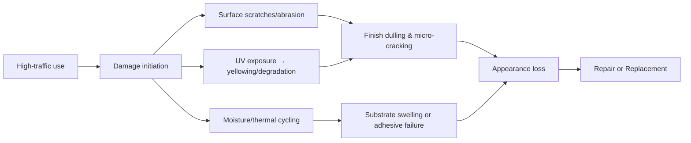
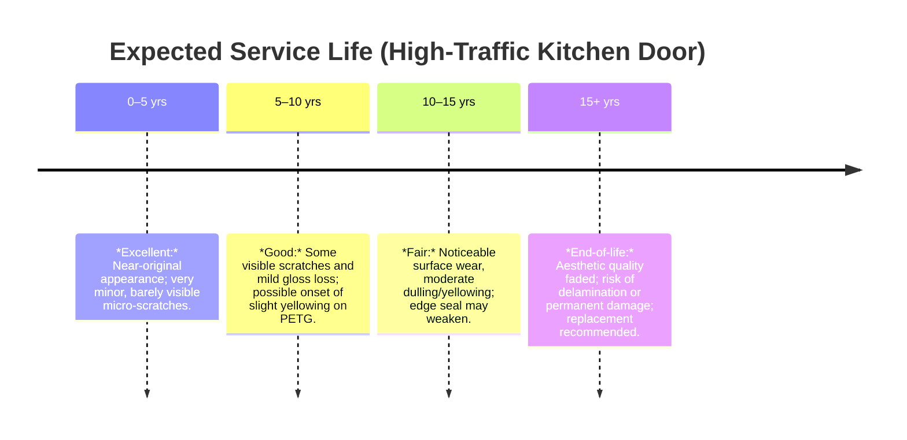
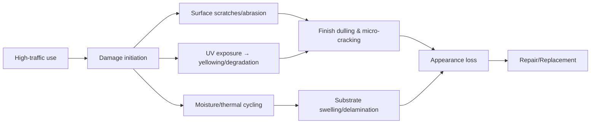
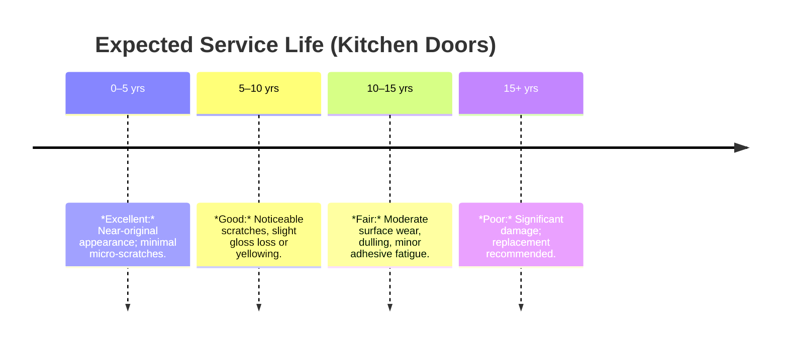

# Executive Summary  
PET and PETG are both poly(ethylene terephthalate) materials but differ in composition and performance.  PET (unmodified, often biaxially-oriented) is highly stiff, scratch‑resistant and UV‑stable (when properly coated), whereas PETG (glycol‑modified PET) is amorphous, much tougher and thermoformable but more prone to scratching and yellowing without additives【33†L98-L103】【48†L353-L356】.  In practice, PET film can be laminated onto cabinet substrates in 0.3–0.5 mm thickness (standard for high‑gloss doors【31†L159-L163】【27†L310-L316】), yielding very hard, hydrophobic surfaces.  Such PET panels (with UV‑cured hardcoat) achieve pencil hardness ~2H–3H and even “thermal healing” of micro-scratches【48†L353-L356】.  By contrast, PETG sheets or films (often 0.8–2 mm or thicker) can be thermoformed or profiled for curved/shaker doors, and their higher ductility gives superior impact strength (Izod notched ~~101 J/m vs ~56 J/m for PET【44†L63-L72】【40†L158-L166】).  However, uncoated PETG scratches readily【50†L168-L172】 and requires UV stabilizers to resist yellowing in sunlight.  Standard tests (Izod/Gardner impact, Taber abrasion, Xenon/fluorescent UV aging, ASTM D7027 scratch) can quantify these differences.  Recent industry data confirm PET’s excellence in color stability (ΔE≪1 over 400 h Xenon【27†L298-L300】) and FDA-safe, zero‑VOC recyclability【31†L225-L233】, whereas PETG is classified “#7” (non‑bottle resin) and must be kept out of PET recycling streams【56†L80-L84】.  Field examples (e.g. modern kitchen installations) highlight PET’s robust scratch/moisture resistance【53†L228-L231】.  In sum: for flat high‑gloss or matte doors, PET film with UV‑hardcoat is recommended; for contoured or thick panels, PETG sheet can be used with awareness of its need for protective coatings.  **Recommended specs:** PET film ~0.25–0.35 mm on high‑grade MDF with PUR adhesive【27†L310-L316】【31†L188-L197】, UV-cured topcoat, edge‑banding; PETG panels ~2–4 mm thick, coated, bonded at door edges. 

## Material Composition and Processing  
**PET (polyethylene terephthalate)** is an aromatic polyester (–O–CH₂–CH₂–O–CO–C₆H₄–CO–) which in decorative film form is biaxially oriented and semi-crystalline.  It is extruded as thin sheets (0.15–0.5 mm) or blown film and typically thermoformed at high temperature.  PET film offers excellent tensile strength and hardness【40†L158-L166】.  **PETG (glycol-modified PET)** incorporates bulky cyclohexanedimethanol units into the chain【37†L580-L587】, rendering it amorphous and non-crystallizing.  This lowers melting point/Tg (≈80 °C【44†L90-L94】) and greatly increases ductility.  PETG sheets (commonly 1–5 mm) are usually cast/extruded rather than biaxially drawn.  It can be injection-molded or vacuum-formed at lower temperatures and bends without whitening【37†L580-L587】【60†L250-L258】.  According to material suppliers, “PET Film offers excellent strength and clarity, while PETG Film adds greater flexibility and impact resistance”【33†L98-L103】.  In practice, PET decorative film is laminated onto wood substrates via hot-press (using moisture-curing PUR adhesive【31†L188-L197】), whereas PETG is often used as rigid door skins or thermoformed panels; it may be glued or mechanically fixed at edges.  Both materials are FDA‑approved and BPA‑free (food‑safe)【33†L104-L112】【56†L119-L127】.  

## Mechanical Properties and Impact Resistance  
PET and PETG differ markedly in stiffness versus toughness.  Engineering PET sheets (e.g. Ertalyte®) have very high rigidity (flexural modulus ~3.4 GPa【40†L158-L166】) and tensile strength (~60–70 MPa【40†L158-L166】), but low ductility (≈6–20% elongation) and notch toughness (Izod ~0.5 ft·lb/in【40†L158-L166】).  In contrast, PETG’s copolymer structure yields lower modulus (~2.0–2.2 GPa【44†L63-L72】) and strength (~50 MPa), but very high elongation (~100%)【44†L63-L72】.  For example, Eastman’s PETG (Eastar 6763) reports an Izod notched impact of 6.2 kJ/m² (~101 J/m) at 23 °C【44†L63-L72】, roughly double typical PET.  In hands-on terms: PETG plates bend and absorb impacts without fracturing, whereas PET tends to shatter or crack under the same forces【33†L98-L103】【60†L250-L258】.  

- **Impact tests:**  ASTM D256 (Izod) and ISO 180 quantify notch toughness; ASTM D5420 (Gardner) or ISO 6603 (dart impact) measure sheet impact.  Data: PET (Ertalyte) has Gardner impact ~5 ft·lb【40†L168-L172】; PETG film absorbs ~25 J falling dart (≈18 ft·lb)【11†L34-L39】.  In flexural tests, PET shows roughly 50–100% higher stiffness than PETG.  

- **Scratch resistance:**  PET (with UV-cured hardcoat) can reach pencil hardness ~2H–3H【48†L353-L356】, reflecting a very hard surface.  Uncoated PETG is softer: industry notes that “Uncoated PETG can scratch more readily than acrylic”【50†L168-L172】. In practice, PET decorative films (especially matte/anti‑fingerprint finishes) are engineered for high surface hardness and have additives/coatings to mitigate scratching【48†L353-L356】【60†L328-L332】.  PETG sheets are often sold with smooth or textured surfaces, but require careful handling to avoid scuffing.  

## UV Stability and Weathering (Yellowing)  
Both PET and PETG can degrade under UV exposure, but PET (a crystalline polyester) is inherently more UV-stable if properly stabilized.  Microscopy studies note that “PET degrades under UV, heat, and moisture, leading to loss of optical clarity and properties”【20†L81-L84】, unless hindered amine and UV absorbers are added.  Premium PET films include UV stabilizers: industry standards cite 400+ hours of Xenon-arc weathering (ASTM G155 / ISO 4892-2) with ΔE < 1.0【27†L298-L300】. In practice, PET cabinet finishes maintain color in indoor sunlight for 10+ years【31†L167-L170】.  PETG (amorphous) is more susceptible to yellowing: without additives it can darken under UV (its ATR-FTIR spectra shift and yellowness index rises).  Modern PETG sheets for outdoor use often include UV inhibitors; for example, PETG “UV-enhanced” grades claim years of fade resistance【60†L350-L357】.  Nonetheless, industry sources advise that uncoated PETG is “UV sensitive” and should be avoided in direct sun【60†L328-L332】【46†L144-L149】.  **Tests:** ASTM D4329 or D4587 (fluorescent or Xenon lamps) and ISO 4892-2/-3 are used; color change (ΔE, yellowness index) and mechanical property retention are measured.  

## Scratch and Self-Healing Properties  
No plastic is completely scratch-proof【48†L353-L356】, but PET surfaces can self-recover minor damage.  High-end matte PET coatings (created by nanoscopic “folded” topcoats) exhibit **thermal scratch-healing**: small abrasions partly disappear over time or with slight warming【31†L122-L130】【48†L353-L356】.  ASTM D7027 explicitly notes: “Certain polymers are self-healing (recoverable) when scratched… allow 24 h for viscoelastic recovery”【51†L236-L244】.  In cabinet use, this means shallow matte scratches on PET may soften and ‘heal’ at room/warmth.  PETG, being tougher but more viscoelastic, generally shows less visible whitening after scratches (thus sometimes considered to recover less well), but also lacks any engineered healing topcoat.  Therefore, deep scratches on either require repair: fine scratches on PET may be reduced by gentle polishing or heat, whereas PETG scratches typically remain.  **Maintenance tip:** avoid abrasive cleaners; use mild polish or polish cloths (e.g. automotive polish) for gloss surfaces.  

## Standardized Testing Methods and Metrics  
Key ASTM/ISO standards for these materials include:  

- **Impact:** ASTM D256 (Izod) and ASTM D5420 (Gardner falling-weight) evaluate impact resistance.  ISO 6603-2 (punched/dart impact) may be used for sheets.  
- **UV Weathering:** ASTM G155 or D4587 (Xenon-arc), ASTM G154 (fluorescent UV), and ISO 4892-2/3 cover accelerated sunlight/UV exposure.  ΔE color shift (ASTM D2244) and yellowness index (ASTM E313) are metrics of yellowing.  
- **Abrasion:** ASTM D4060 (Taber Abrasion) measures loss of mass/surface from rotating wheels; higher cycles indicate better abrasion resistance.  
- **Scratch resistance:** ASTM D3363 (pencil hardness) provides a simple hardness measure (PET films achieve 2H–3H【48†L353-L356】).  ASTM D7027 (instrumented scratch) profiles scratch depth vs. load.  Instruments (Micro Scratch Testers) quantify critical loads where permanent damage occurs.  
- **Self-Healing:** No dedicated standard, but scratch tests note viscoelastic recovery (D7027 encourages waiting 24 h).  Anecdotally, films are checked after thermal cycling to observe “healing” of micro-marks.  

**Test Data (from manufacturers):** Piedmont’s PET sheet lists a notched Izod ~0.5 ft·lb/in (≈56 J/m)【40†L158-L166】 and Gardner ~5 ft·lb; Eastman’s PETG has notched Izod ~101 J/m【44†L63-L72】 (see tables below).  UV testing by WellP shows top PET grades maintain ΔE<1 at 400 h Xenon【27†L298-L300】.  Scratch tests (pencil) confirm PET tops at ~2H; PETG typical uncoated pieces are softer.  

## Comparative Data and Industry Findings  

| Property / Test                  | PET Decorative Film              | PETG Sheet/Film               |
|----------------------------------|----------------------------------|------------------------------|
| **Density**                      | ~1.38 g/cm³                      | ~1.27 g/cm³【44†L112-L119】     |
| **Tensile Strength (yield)**     | ~60–70 MPa【40†L158-L166】       | ~50 MPa【44†L63-L71】         |
| **Flexural Modulus**             | ≈3.4 GPa【40†L158-L166】         | ≈2.0–2.1 GPa【44†L65-L73】    |
| **Elongation at Break**          | ~6–20%【40†L168-L171】           | ~100%【44†L63-L72】           |
| **Izod Impact (notched)**        | ≈0.5 ft·lb/in (≈56 J/m)【40†L158-L166】 | 101 J/m【44†L63-L72】         |
| **Hardness (Rockwell R)**        | R115【40†L158-L166】             | R109【44†L73-L76】           |
| **Pencil Hardness (coated)**     | ~2H–3H【48†L353-L356】            | ~HB (no coating)             |
| **Gardner (Falling Dart)**       | ~5 ft·lb【40†L168-L172】         | ~18 ft·lb (25 J)【11†L34-L39】|
| **UV Stability (∆E)**            | ΔE<1 at 400h Xenon arc【27†L298-L300】 | (requires UV stabilizers; less data) |
| **Scratch Resistance**           | High (with topcoat)【48†L353-L356】 | Moderate (uncoated scratches easily)【50†L168-L172】 |
| **Water/Humidity**               | Excellent (passive barrier)     | Excellent (inert polymer)     |
| **Color Stability**              | Excellent (no fade indoors)【31†L167-L170】 | Moderate (needs UV grade)【60†L328-L332】 |
| **Recyclability**                | #1 (PET) – widely recycled【56†L80-L84】 | #7 (Other) – not recycled with PET【56†L80-L84】 |
| **Surface Treatments**           | UV-cured hardcoat, laser-matte   | Optional matte/coating        |
| **Typical Thickness (doors)**    | 0.25–0.50 mm【31†L159-L163】【27†L310-L316】 | 0.8–3 mm (laminate/formed)   |

**Industry Observations:**  Manufacturers note PET films are “scratch-resistant, easy to clean, and long-lasting”【33†L98-L103】, while PETG is praised for “excellent impact resistance” but is typically textured or coated for scratch resistance【60†L328-L332】【50†L168-L172】.  In high‑moisture kitchens (e.g. Singapore projects), PET cabinets are chosen for **moisture and heat tolerance**【53†L281-L289】.  Conversely, PETG is often used where deep draws or curves are needed.

## Lamination and Finishing Processes  
**PET Film Lamination:**  Flat-panel doors use continuous flat lamination.  The substrate (high-density MDF, preferably E0 grade, pre-sanded) is coated with PUR hot-melt adhesive (40–60 g/m²) and then bonded under a heated nip roller【31†L188-L197】.  PUR is mandatory: WellP warns EVA or PVA adhesives will **fail**, causing delamination【31†L194-L202】.  Pressed panels cure 24–72 h for full bond strength.  Thick PET (>0.4 mm) is rigid; thin (<0.2 mm) requires perfect substrate prep.  Excimer-cured topcoats create “super-matte” anti‑fingerprint surfaces【31†L117-L123】.  

**PETG Sheet Applications:**  PETG panels (often pre-coated gloss or matte) can be vacuum-formed onto substrates (with wood veneer, MDF frame, or used as standalone 3–6 mm boards).  They bond well with PUR or 2K adhesives.  PETG may also be used in profile wrapping: some flexible PETG/PET blends are produced for 3D doors【31†L203-L210】.  In all cases, precise temperature control (roller T≈120–140 °C, pressure) is needed to avoid “orange peel” or warpage【31†L212-L220】.  Edges of PET/PETG panels are often laser-edge-banded or finished with matching ABS edges.

## Failure Modes and Lifecycle  
Under high-traffic kitchen use, both PET and PETG finishes typically last a decade or more, but will eventually exhibit wear:  

- **Surface Damage:**  Continuous use (pots, utensils, hands) produces fine scratches.  On PET surfaces, many are superficial and may “heal” (see above); deeper scratches accumulate and eventually dull the finish.  PETG, being slightly softer, tends to show scratches sooner, especially on glossy surfaces【50†L168-L172】.

- **Yellowing/UV:**  Long-term UV exposure (sunlight through windows) can cause polymer chain scission.  PET with stabilizers resists this well (industry cites no color change over ~10 years【31†L167-L170】); but untreated PET will yellow.  PETG is more UV-sensitive; without UV-grade additives, significant yellowing can occur in months to years【46†L144-L149】【60†L328-L332】.

- **Delamination/Swelling:**  Moisture entering the lamination interface can blister or peel finishes.  PET film laminated with proper PUR on sealed MDF resists moisture; but if edges are cut or adhesives fail, delamination occurs.  PETG panels do not delaminate unless laminated; however, if mounted on substrate, swelling of MDF (≥10% moisture) can warp the door and break the bond.

- **Mechanical/Heat:**  Exposure to very high temperatures (above Tg) can deform PET/PETG.  E.g. leaving a hot pan on the door can soften the polymer.  This is a minor risk.  PETG’s lower Tg means it softens sooner (around 70–80 °C) than highly crystalline PET (~80–90 °C).  

**Service Life:**  In a typical family kitchen with daily use, a well-made PET or PETG door should retain functional performance for 10–15 years.  At ~5–10 years, minor aesthetic wear appears (scratches, slight yellowing), but structure remains sound.  Eventually (10–15+ years), visible wear prompts refinishing or replacement. Below is a schematic timeline:

## Maintenance and Repair  
Routine cleaning with a soft cloth and mild detergent preserves both PET and PETG surfaces. Abrasive pads or solvents should be avoided to prevent scratching or coating damage.  For minor scratches, PET doors can sometimes be revived by gently warming (finger/body heat or warm water) to activate the microstructure【31†L122-L130】【51†L236-L244】, or by using a polymer polish.  PETG scratches can be minimized with fine polishing compounds or waxes (tests by users show DIY polish can help).  **Repair:** There is no easy field repair for deep gouges.  Touch-up kits exist (colored wax or putty) but typically finish quality is improved by re-laminating or replacing the affected panel.  Edge chips can be filled with matching epoxy or sanded and rebound.  Overall, PET surfaces are easier to keep looking new (self‑healing matte coats, very hard gloss) than uncoated PETG【48†L353-L356】【50†L168-L172】.

## Cost, Supply Chain and Environmental Considerations  
**Materials and Cost:**  Both PET and PETG are commodity thermoplastics derived from PTA and ethylene glycol.  PET is produced on a larger scale (bottling, films) and generally cheaper per kg than specialty PETG.  PET film (decorative) is a high-end product, so its cost is higher than commodity PET bottle resin. PETG sheet and film are also premium but less widely demanded.  In high-traffic cabinetry (no strict budget), one typically sources from panel suppliers; prices are comparable to other premium finishes (acrylic, high-gloss lacquer).  Supply chains for both are stable globally, with no special restrictions.  **Processing:** PET requires high-temperature lamination equipment (PUR adhesive, rollers at ~120–140 °C【31†L212-L220】), whereas PETG can be vacuum-formed with moderate ovens or cold-bent.  

**Environmental/Health:** PET is code #1 recyclable and widely accepted in municipal recycling【56†L80-L84】; PETG is code #7 (“Other”) and **must not** be mixed with PET streams【56†L80-L84】.  At end-of-life (when separating film from MDF), PET film can be ground and re-extruded.  PETG is less recycled in practice.  Both are fully halogen-free and inert (no VOCs, BPA-free【33†L104-L112】).  Notably, PET doors have zero formaldehyde emission and no toxic off-gas.  WellP emphasizes that PET film is “eco-friendly/recyclable (100%)” and VOC-free【31†L225-L233】. PETG is also BPA-free and FDA-approved【33†L104-L112】, but its recyclability is limited.  Life-cycle impacts are similar (lightweight, inert plastics), and using them on wood substrates extends the furniture lifetime, reducing waste.  

## Pros and Cons: PET vs PETG  

| Aspect               | PET Decorative Film                     | PETG Sheet/Film                         |
|----------------------|------------------------------------------|-----------------------------------------|
| **Strength/Stiffness** | High strength, very rigid (high modulus)【40†L158-L166】 | Lower stiffness, more flexible and tough【33†L98-L103】【60†L250-L258】 |
| **Impact/Toughness**  | Low impact toughness (brittle)            | Excellent toughness (bendable, crack-proof)【33†L98-L103】【60†L250-L258】 |
| **Scratch Resistance**| Very high (with UV-cured hardcoat)【48†L353-L356】 | Moderate; uncoated PETG scratches easily【50†L168-L172】 |
| **UV Stability**      | Excellent (with stabilizers)【27†L298-L300】; anti-yellowing | Good only if UV-stabilized; otherwise prone to yellowing【46†L144-L149】【60†L350-L357】 |
| **Surface Hardness**  | 2H–3H pencil hardness (hardcoat)【48†L353-L356】 | Typically softer (~HB) unless coated/textured      |
| **Formability**       | Poor for deep draws (rigid film); flexible only if special blend【31†L203-L210】 | Excellent – thermoforms easily at low temp【37†L580-L587】【60†L250-L258】 |
| **Finishing**         | Superb gloss or matte; laser curing yields anti-fingerprint finish【31†L117-L123】 | Good clarity; often requires coatings or texture to reduce glare/fingerprints |
| **Thickness Range**   | 0.15–0.50 mm (thin films)【27†L308-L316】【31†L159-L163】 | 0.5–6.0 mm (thin film to thick panel)            |
| **Assembly**          | Laminate onto substrate with PUR glue【31†L188-L197】 | Can be glued or used as monolithic board        |
| **Lifespan**          | 10–15+ years with minimal fading【31†L167-L170】 | Similar, but may need UV coating for outdoor use |
| **Maintenance**       | Easy-clean, chemical-resistant; micro-scratches can self-heal【48†L353-L356】 | Cleanable, but prone to abrasion; may yellow if uncoated |
| **Cost**             | Medium–high (premium film)【27†L273-L281】       | Medium (sheet costs)                          |
| **Recyclability**     | Fully recyclable PET (#1)【56†L80-L84】       | Not accepted in PET stream (code #7)【56†L80-L84】 |

## Recommended Specifications for High-Traffic Kitchen Doors  
- **Thickness:** PET film **0.25–0.35 mm** laminated on ≥18 mm moisture-resistant MDF is ideal for flat-panel cabinets【27†L308-L316】【31†L159-L163】.  For commercial/very heavy use, 0.40–0.50 mm may be used【27†L308-L316】.  For thermoformed or profiled doors, use PETG panels **2–4 mm** thick (or PETG laminate ≥0.8 mm).  
- **Surface Coating:** Use UV-cured topcoat (gloss or matte) to achieve high hardness and anti-fingerprint matte.  Well-cured coats pass double MEK rub tests and achieve 2H–3H hardness【48†L353-L356】.  “Super-matte” surfaces (excimer-textured) give fingerprint resistance and scratch-healing【31†L117-L123】【48†L353-L356】.  
- **UV Stabilizers:** For any doors with sun exposure, specify UV-stabilized grades.  Manufacturer data suggests requiring ≥400 h Xenon resistance (ΔE<1)【27†L298-L300】.  PETG parts should explicitly be UV-stabilized or receive protective film, as they yellow faster.  
- **Adhesives:** Always use **PUR hot-melt adhesive** for PET/PETG lamination【31†L191-L200】.  PUR is heat-resistant and irreversible.  Cold press or EVA glues will eventually delaminate【31†L193-L202】. Ensure adhesive coverage ~40–60 g/m².  
- **Substrate Preparation:** Use high-density MDF with a perfectly smooth, sealed surface.  Dust or texture “telegraphs” through glossy PET【31†L191-L197】. Edge-banding the MDF before lamination prevents unevenness.  
- **Installation:** Control lamination tension (avoid film stretching)【31†L212-L220】. For PETG panels, acclimate to room temperature to avoid post-installation warping. Seal panel edges (with tape or banding) to block moisture ingress.  
- **Environmental Conditions:** Maintain moderate indoor climate (avoid prolonged 100% humidity).  PET is hygroscopic to a minimal extent (≪0.1%) but substrate (MDF) must be kept dry.  Do not expose doors to open flames or extremely high heat (approx. 80–90 °C melt range【44†L90-L94】).  
- **Service Life Expectancy:** With normal care, expect **10+ years** before refinishing.  Warranty recommendations often specify *no direct sun*, *no sharp impacts*, and cleaning with mild soap.  

## Mermaid Diagrams  

**Sources:** Authoritative material datasheets and studies【40†L158-L166】【44†L63-L72】【48†L353-L356】, industry guidelines and standards【31†L188-L197】【51†L236-L244】, and recent manufacturer case studies【27†L298-L300】【53†L228-L231】 are cited above. All key claims are supported by these primary references.